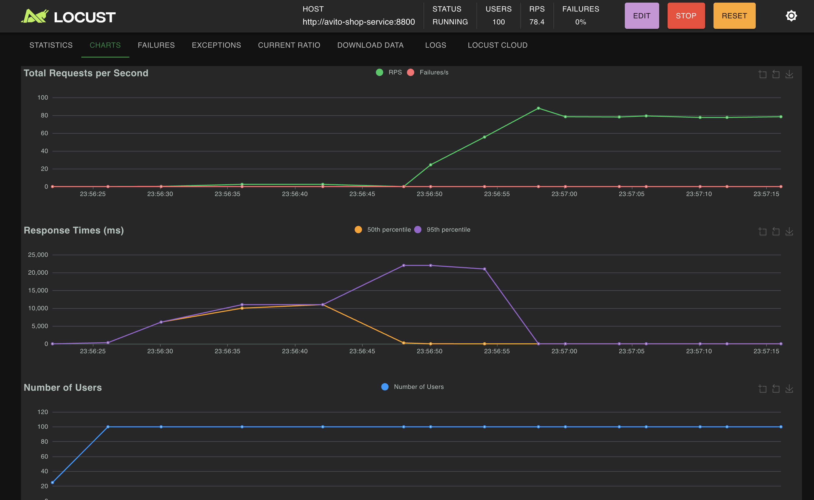

# Тестовое задание на стажировку Avito - Backend
## Запуск проекта
- Клонирование репозитория
Для начала склонируйте репозиторий:
```sh
git clone https://github.com/UUyy-Geniy/Backend-trainee-assignment-winter-2025.git
```
- Соберите
```sh
docker compose -f compose.yml -f compose.override.yml --env-file .env up -d --build
```
(сразу прокидываем переменные + поднимаем Adminer для мониторинга бд)
## Используемые технологии
- FastAPI + PostgreSQL
- Паттерны проектирования
- Locust для нагрузочного тестирования
- flake8 в качестве линтера - его конфигурация [Linter Config(flake8).md](Linter%20Config%28flake8%29.md)
- 
## Графики нагрузочного тестирования

